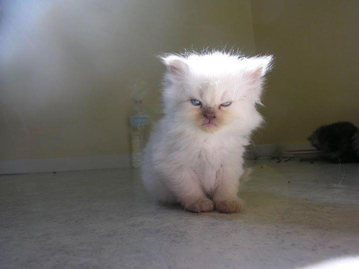

# 🐱 posh-cats [](https://ci.appveyor.com/project/kidchenko/posh-cats/branch/master)

> A cross-platform cats module for powershell.




A cross-platform cats module for powershell.

## Install

```
Install-Module posh-cats
```

## Usage

```powershell
Get-CatName # Get random name of cats.

Get-CatEmoji # Get a cat face emoji.

Get-CatBuzz # Open the "100 Most Important Cat Pictures Of All Time" page on BuzzFeed.

Get-CatImage # Get a random image of cats.

Get-CatMeowMix # Open a MeowMix video in youtube.

Get-CatMeow # Play a meow sound effect.

Get-CatBabyMeow # Play a baby cat meow sound effect.

Get-CatFight # Play a sound effect of cats fighting.

Get-CatAngry # Play a sound effect of a cat angry.

Get-CatPurr # Play a purr (that sound when the cat want love) sound effect.

Get-CatYowl # Play a yowl (that sound when the cat is angry) sound effect.

```

## Related

- [cat-names](https://github.com/sindresorhus/cat-names) Get popular cat names.

- [posh-dogs](https://github.com/kidchenko/posh-dogs) - A cross-platform dogs module for powershell.

## License

MIT © [Jose Barbosa](http://kidchenko.com/)